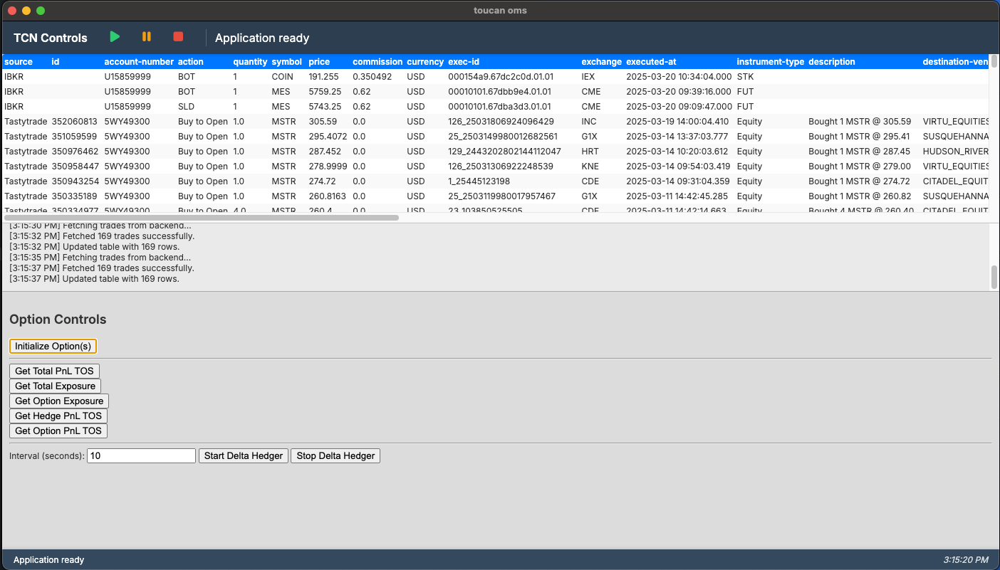

# tcn delta hedger




## Technical Stack
- **Frontend**: HTML5, CSS3, JavaScript
- **Backend**: Python, Flask
- **APIs**: IBKR, Tastytrade, Schwab 

## Installation

1. Clone the repository:
```bash
git clone https://github.com/yourusername/toucan_oms_dev.git
cd toucan_oms_dev
```

2. Set up Python virtual environment:
```bash
python -m venv venv
source venv/bin/activate  # On Windows: venv\Scripts\activate
```

3. Install dependencies:
```bash
pip install -r requirements.txt
```

4. Configure credentials:
   - Create `creds.yaml` for API credentials
   - Create `tos-creds.yaml` for Tastytrade credentials
   - Add necessary API tokens to `tokens.json`

## Configuration
Create the following configuration files (these are git-ignored for security):

### creds.yaml
```yaml
user:
  - your_username
pw:
  - your_password
```

### tos-creds.yaml
```yaml
username: your_tastytrade_username
password: your_tastytrade_password
```

## Usage

1. Start the backend server:
```bash
python backend/backend.py
```

2. Open `index.html` in your browser or serve it using a local server.

3. Use the toolbar controls to:
   - Start trading system
   - Pause execution
   - Stop all operations

## Options Workflow
- Total PnL monitoring
- Exposure tracking
- Delta hedging
- Trade execution
